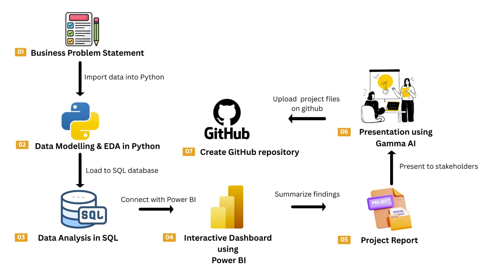
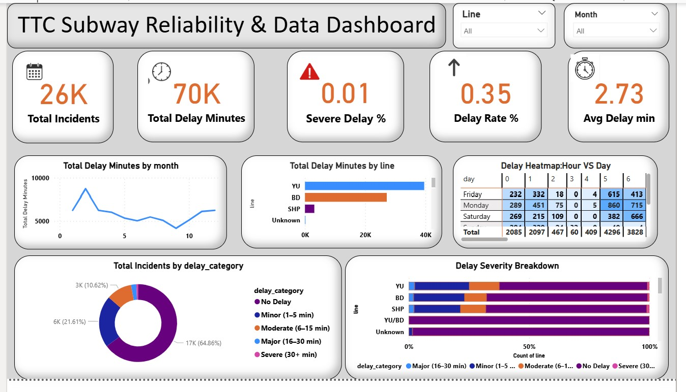
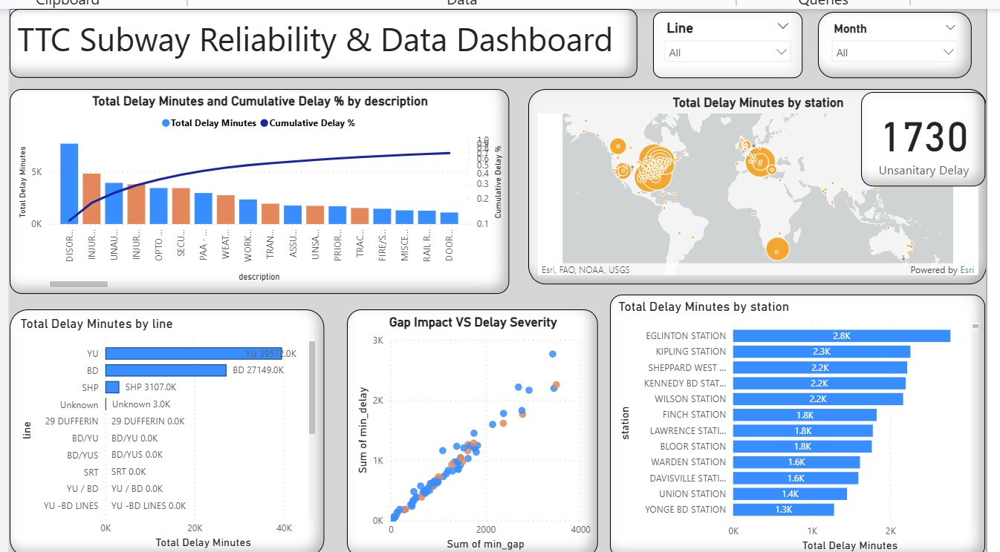

# TTC-delay-data-analysis-python-SQL-power-BI

This project presents a complete, end-to-end Business Intelligence workflow focused on analyzing subway service reliability, delay patterns, and operational risk drivers within the Toronto transit network.

The objective is to transform raw operational incident data into actionable business intelligence using structured analytics, data modeling, DAX calculations, and interactive dashboard storytelling.

🎯 Who This Project Is For

📊 Data Analyst aspirants building a strong BI portfolio

📈 Business Intelligence & Reporting roles

🧠 Professionals preparing for analytics interviews

🏢 Recruiters evaluating real-world dashboard capability

📌 Project Overview

This project simulates a real-world transit operations analytics scenario.

The analysis focuses on:

Identifying high-impact delay drivers

Evaluating severity distribution across subway lines

Performing Pareto-based root cause analysis

Analyzing station-level delay concentration

Assessing operational gap impact on service reliability

The final output is a multi-page Power BI dashboard designed for executive-level decision support.

🔄 End-to-End Workflow

1️⃣ Data Preparation & Cleaning

2️⃣ Data Modeling & DAX

3️⃣ Root Cause & Pareto Analysis

4️⃣ Interactive Dashboard Development (Power BI)

## Workflow Overview

📈 Key Insights

Yonge-University line contributes the largest share of delay minutes.

Minor delays (1–5 min) dominate incident frequency.

A limited number of delay descriptions account for majority of total delay impact.

Certain stations consistently report elevated delay volumes.

Strong correlation observed between service gap and delay severity.

📊 Dashboard Preview

🛠️ Tools & Technologies

Power BI (Data Modeling & Dashboarding)

DAX (Advanced Calculated Measures)

Data Cleaning & Transformation(Python, Pandas, Numpy)

ESRI Map Visual

Pareto & Root Cause Analysis Techniques(Seaborn, Matplotlib)

📜 License

MIT — Feel free to fork, star, and use in your portfolio.
